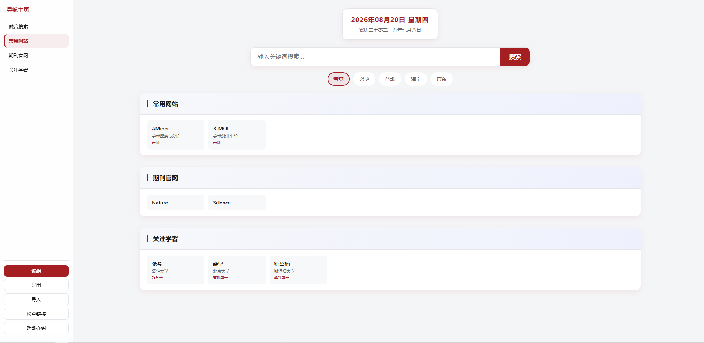

# OmniPage 导航主页

> 你的个人网址导航页：一个文件，双击就能用，不用安装任何东西。

**在线体验**：[https:/hemanruc.github.io/OmniPage/](https://hemanruc.github.io/OmniPage/)

---

## 一、这个项目解决什么问题？

用浏览器书签收藏网站的人越来越多会遇到这些烦恼：

| 😣 浏览器书签的烦恼 | ✅ OmniPage 怎么解决 |
|----------------------|----------------------|
| 收藏的网站太多，书签栏一长串，找起来费劲 | 网站按**分类卡片**整齐排列，左边栏点分类名直接跳转 |
| 书签只能分文件夹，层级一多就乱，类别不清晰 | 分类一目了然，可随意**新增、改名、拖动排序**，按自己的习惯组织 |
| 书签只能存一个名字，想多写点备注没办法 | 每个网址支持**名称 + 网址 + 备注 + 关键词**多重信息，鼠标悬停即可查看 |
| 收藏久了，很多网站已失效也不知道 | 一键「**检查链接**」，失效网址自动标红点 |
| 换电脑、换浏览器，书签迁移麻烦 | 「**导出**」成一个文件，新设备上「**导入**」即可完整恢复 |

而且整个导航页**只是一个 HTML 文件**——不用安装、不用注册、不用联网服务器，数据只存在你自己的电脑里，隐私安全。

## 二、开始使用（两种方式任选）

两种方式都需要先下载文件：

**下载方法**：在本页面上方文件列表中点击 `index.html` → 进入文件页面后，点右上角的**下载按钮（⬇ 图标）**，文件就保存到电脑了（通常在「下载」文件夹里）。

### 方式 A：放在固定目录 + 设为浏览器书签/主页

适合：习惯从浏览器书签栏打开的人。

**第 1 步：把文件放到固定位置**

1. 打开「文件资源管理器」，进入 C 盘（`C:\`）
2. 在空白处右键 →「新建」→「文件夹」，起个名字，比如 `我的导航`
3. 把下载好的 `index.html` **剪切**进这个文件夹
   （最终路径类似 `C:\我的导航\index.html`）
   > ⚠️ 放好后就不要再移动或删除这个文件，否则书签会失效

**第 2 步：设为书签（放在书签栏最左边）**

1. 双击 `index.html`，用浏览器打开它
2. 按 `Ctrl + D`（Mac 按 `Cmd + D`）添加书签，保存位置选「**书签栏**」
3. 在书签栏上**按住这个新书签，拖到最左边**，以后一点即到

**（可选）第 3 步：设为浏览器主页，打开浏览器就是它**

- **Edge**：设置 →「开始、主页和新建标签页」→ 打开方式选「打开特定页面」→ 添加页面 → 填入文件路径，格式如 `file:///C:/我的导航/index.html`
- **Chrome**：设置 →「启动时」→「打开特定网页」→ 填入同样的 `file:///C:/我的导航/index.html` 路径

### 方式 B：桌面快捷方式，双击即用

适合：习惯从桌面打开的人。

1. 先按方式 A 的第 1 步，把 `index.html` 放到一个固定文件夹（比如 `C:\我的导航\`）
2. 在该文件上点**右键** →「显示更多选项」（Win10 可跳过）→「**发送到**」→「**桌面快捷方式**」
3. 桌面上会出现一个快捷方式图标，可以右键「重命名」改成「导航主页」
4. 以后**双击桌面图标**就能打开使用了

> 💡 数据存在浏览器里：无论你用哪种方式打开，只要用的是同一个浏览器，你的修改都在。

## 三、一步步教你用每个功能

### 🔍 功能 1：搜索

1. 在页面顶部找到搜索框
2. 输入你想搜的内容（比如「红烧肉做法」）
3. 按**回车键**，或点右边的「**搜索**」按钮
4. 想换搜索引擎？点搜索框下面的「夸克 / 必应 / 谷歌 / 淘宝 / 京东」标签即可，选中的会有红圈标记

### 📂 功能 2：打开收藏的网址

- 页面上一个个小卡片就是网站链接，**点击卡片**即可在新标签页打开
- 左边栏是分类目录，点分类名字可以快速跳到对应区域
- 鼠标悬停在卡片上，可以看到完整网址、备注和关键词

### ✏️ 功能 3：添加 / 修改网址（最重要！）

**第一步：进入编辑模式**
点左边栏下方的红色「**编辑**」按钮。

**第二步：你会看到页面变了**
- 每个网址卡片变成了可以输入文字的格子
- 左边栏出现「保存」和「取消」按钮

**第三步：想做什么就做什么**

| 我想…… | 怎么做 |
|--------|--------|
| 改某个网址的名字 | 直接在卡片的第一个格子里修改 |
| 改网址地址 | 在第二个格子（URL）里修改，注意要以 `http` 开头 |
| 加备注/关键词 | 在第三、四个格子里填写（可选，方便以后辨认） |
| 添加新网址 | 滚动到该分类最下面，点「➕ 添加链接」，然后填写 |
| 删除某个网址 | 点卡片上的红色「删除」按钮 |
| 调整网址顺序 | 按住卡片不放，**拖动**到想要的位置再松手 |
| 新增一个分类 | 滚动到页面最底部，点「添加新分类」 |
| 改分类名字 | 直接修改分类标题那一栏的文字 |
| 调整分类顺序 | 点分类标题右边的 ↑ ↓ 箭头 |
| 删除整个分类 | 点分类标题右边的「删除」（会弹窗确认） |

**第四步：保存！**

改完后点左边栏的绿色「**保存**」按钮，看到「已保存到本地」提示就完成了。

> ⚠️ 如果点「取消」，刚才的所有修改都会丢弃，恢复到编辑前的样子。

### 📅 功能 4：看日期和农历

页面顶部自动显示今天的公历日期、星期几和农历，不用任何操作。

### 🔗 功能 5：检查网址是否失效

1. 点左边栏的「**检查链接**」按钮
2. 等待一会儿（网址多的话需要一两分钟），检查中的卡片右上角会有黄色小点在闪
3. 检查完成后，**打不开网址的卡片右上角会出现红色小圆点**
4. 你可以进入编辑模式，把这些失效的网址删除或更新

> 提示：少数网站因为有防护机制可能被误标为失效，遇到这种情况手动打开确认一下即可。

### 💾 功能 6：备份和恢复（换电脑必看）

**备份（导出）：**

1. 点左边栏的「**导出**」按钮
2. 在弹出的窗口里点「**下载文件**」
3. 得到一个 `.json` 文件（比如 `omnipage-2026-08-20.json`），**把它保存好**，比如保存到和html同一个文件夹`file:///C:/我的导航/index.html` 路径，也可以存到网盘或 U 盘
4. 建议自己设置好一系列网址后，一定记得导出备份，避免因为清楚浏览器缓存导致编辑内容失效！

**恢复（导入）：**

1. 在新电脑/新浏览器上打开 OmniPage
2. 点左边栏的「**导入**」按钮
3. 点「上传文件」，选择之前备份的那个 `.json` 文件
4. 点「**确认导入**」，所有网址就回来了

> ⚠️ 导入会**覆盖**当前页面上的所有数据，操作前确认当前数据不需要保留。

## 四、常见问题（FAQ）

**Q：我的数据存在哪里？安全吗？**
A：只存在你自己电脑的浏览器里（一种叫 localStorage 的本地存储），不经过任何服务器，别人看不到。

**Q：清除浏览器缓存会丢数据吗？**
A：会！如果清理浏览器数据时勾选了「网站数据 / Cookie 和其他网站数据」，本页的数据会被清掉。所以**重要数据记得用「导出」功能备份**。

**Q：我把 index.html 挪了位置，书签打不开了怎么办？**
A：书签记录的是文件路径，文件移动后旧书签会失效。重新双击打开文件，再按 `Ctrl + D` 收藏一次，删掉旧书签即可（你的数据不会丢，数据存在浏览器里而不是文件里）。

**Q：可以把别人的备份文件导入吗？**
A：可以，只要对方也是用 OmniPage 导出的 JSON 文件。

## 五、许可证

MIT License — 任何人都可以自由使用、修改和分享这个项目。
